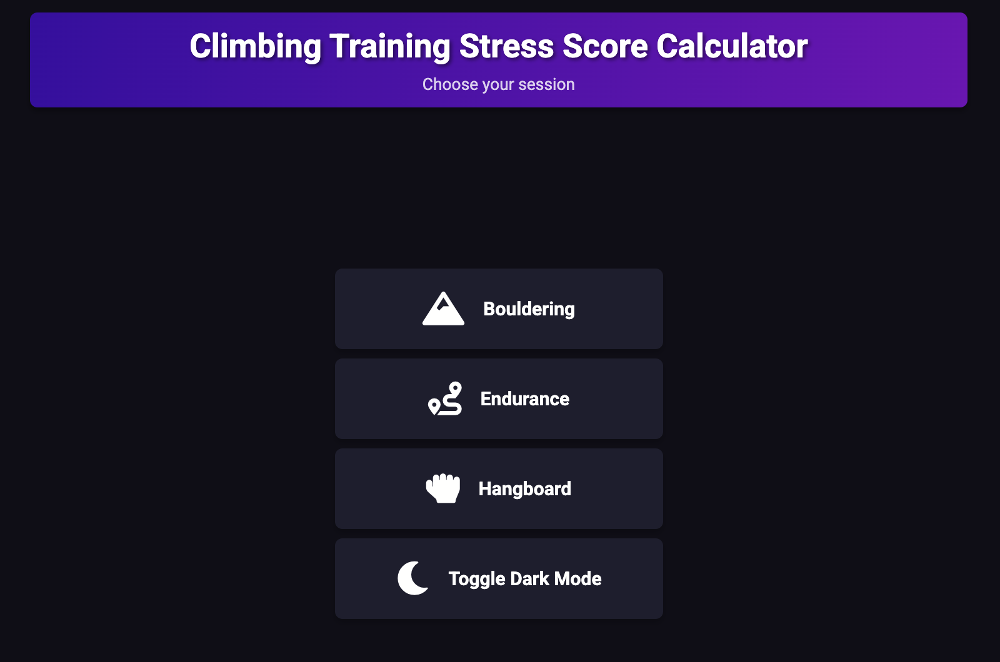

# CTSS Calculator

The CTSS Calculator is a simple tool designed to help users calculate their Climbing Training Stress Score (CTSS)



## Features

- Calculate CTSS based on workout data
- Detailed results and analysis

## Usage

*Requires python3 and flask*
Spin up the server
```sh
python3 server.py
```

Access the site in your browser at localhost:5000

## Contributing

Contributions are welcome! Please fork the repository and submit a pull request with your changes.

## License

This project is licensed under the GPL3 License. See the [LICENSE](LICENSE) file for details.
