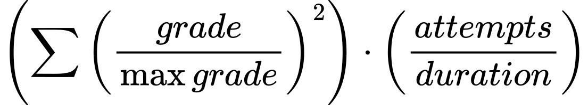
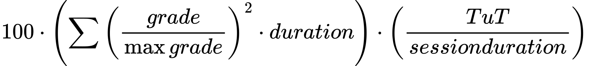

# CTSS Calculator

The CTSS Calculator is a simple tool designed to help users calculate their Climbing Training Stress Score (CTSS)


## Equations


- pretty self explanatory


- duration is the amount of time you spent climbing on each route attempt in... hours?
- TuT is session time under tension in hours
- Session duration is the length of the whole session in hours


- relintensity is the relative intensity to your max. 90% one rep max would be 0.9
- Time under tension per set is in minutes
- Total session time under tension is in minutes
- Total session time is in hours (maybe should be minutes?)
- scaling factor is currently 2.5 because I thought that seemed reasonable

## Features

- Calculate CTSS based on workout data
- Detailed results and analysis

## Usage

*Requires python3 and flask*
Spin up the server
```sh
python3 server.py
```

Access the site in your browser at localhost:5000

## Contributing

Contributions are welcome! Please fork the repository and submit a pull request with your changes.

## License

This project is licensed under the GPL3 License. See the [LICENSE](LICENSE) file for details.
