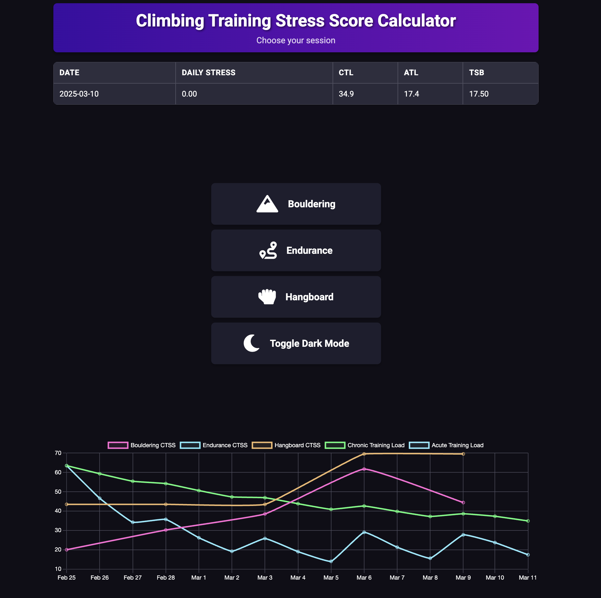

# CTSS Calculator

The CTSS Calculator is a simple tool designed to help users calculate their Climbing Training Stress Score (CTSS)



## Training Load Formulas

### Session-Specific CTSS Calculations

#### **Bouldering CTSS**
```math
CTSS_{bouldering} = \left( \sum \left( \frac{\text{Grade Attempted} + 1}{\text{Max Session Grade} + 1} \right)^2 \times \text{Attempt Count} \right) \times \frac{\text{Total Attempts}}{\text{Duration (hours)}}
```
- **Grade Attempted**: V-scale grade of climbed problem  
- **Max Session Grade**: Highest grade attempted in session  
- **Attempt Count**: Number of tries per grade  
- **Duration**: Session length in hours

---

#### **Endurance CTSS**
```math
CTSS_{endurance} = 100 \times \left( \sum \left( \frac{\text{Route Grade}}{\text{Max Session Grade}} \right)^2 \times \text{Climbing Time (hours)} \right) \times \frac{\text{Total Climbing Time}}{\text{Session Duration}}
```
- **Route Grade**: Difficulty of individual routes (YDS scale)  
- **Climbing Time**: Time spent actively climbing per route  
- **Session Duration**: Total session length in hours

---

#### **Hangboard CTSS**
```math
CTSS_{hangboard} = \left( \sum \left( \text{Intensity}^2 \times \text{Reps} \times \frac{\text{Seconds per Rep}}{60} \right) \right) \times \frac{\text{Total Time Under Tension}}{\text{Duration (hours)}}
```
- **Intensity**: % of max hang capacity (0-1)  
- **Reps**: Number of repetitions per set  
- **Seconds per Rep**: Hold duration per repetition

---

### Chronic Training Load (CTL) / Acute Training Load (ATL)
```math
\begin{align*}
CTL_{today} &= CTL_{prev} \times \left( \frac{29}{30} \right)^{days} \times \frac{29}{30} + CTSS_{today} \times \frac{1}{30} \\
ATL_{today} &= ATL_{prev} \times \left( \frac{6}{7} \right)^{days} \times \frac{6}{7} + CTSS_{today} \times \frac{1}{7}
\end{align*}
```
- **days**: Full days between sessions  
- **29/30**: 30-day decay factor for CTL  
- **6/7**: 7-day decay factor for ATL  
- **CTSS**: Combined daily stress from all sessions

---

### Training Stress Balance (TSB)
```math
TSB = CTL - ATL
```
- **Positive TSB**: Indicates freshness for performance  
- **Negative TSB**: Indicates accumulated fatigue

---

## Key Features
1. **Time-Aware Calculations**  
   - Strict UTC date handling prevents timezone errors  
   - Future date validation ensures data integrity

2. **Exponential Decay Model**  
   - Rest days automatically reduce CTL/ATL  
   - Recent sessions weighted more heavily than older ones

3. **Session-Type Specificity**  
   - Different formulas respect unique physiological demands  
   - Intensity squared terms emphasize hard efforts

4. **Synthwave Visualization**  
   - Dark/light mode compatible color schemes  
   - Distinct colors for all metrics  
   - Responsive Chart.js implementation

---

## Example Calculation
**3 Rest Days After Session**  
```math
\begin{align*}
CTL_{new} &= 96.5 \times \left( \frac{29}{30} \right)^3 \approx 93.3 \\
ATL_{new} &= 96.5 \times \left( \frac{6}{7} \right)^3 \approx 80.7 \\
TSB &= 93.3 - 80.7 = +12.6
\end{align*}
```

## Usage

*Requires python3 and flask*
Spin up the server
```sh
python3 server.py
```

Access the site in your browser at localhost:5000

## Contributing

Contributions are welcome! Please fork the repository and submit a pull request with your changes.
You are also welcome to contribute via the [github discussions](https://github.com/rtkaratekid/ctss_calculator/discussions)

## License

This project is licensed under the GPL3 License. See the [LICENSE](LICENSE) file for details.
