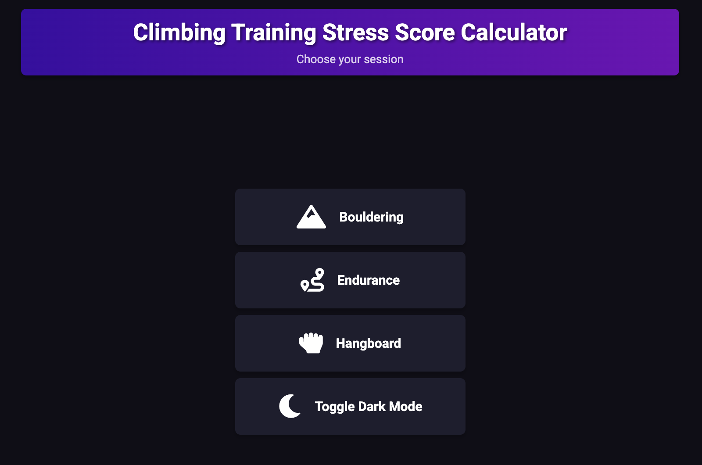

# CTSS Calculator

The CTSS Calculator is a simple tool designed to help users calculate their Climbing Training Stress Score (CTSS)

## Features

- Calculate CTSS based on workout data
- Detailed results and analysis

## Usage

Follow the on-screen instructions to input your workout data and receive your CTSS.

## Contributing

Contributions are welcome! Please fork the repository and submit a pull request with your changes.

## License

This project is licensed under the GPL3 License. See the [LICENSE](LICENSE) file for details.
